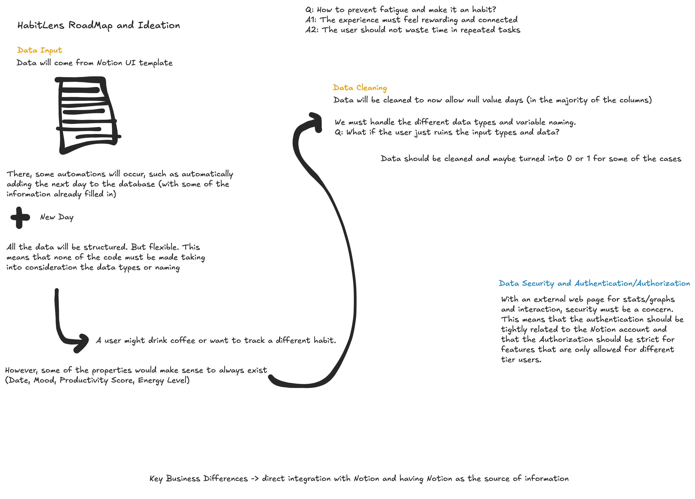

# HabitLens

**HabitLens** is a machine learning project that connects to your Notion database to analyze daily habits, provide insights, and generate intelligent reports about your lifestyle patterns.

## 🚀 Features

- **🔗 Notion Integration**: Seamlessly connects to your Notion database to fetch daily habit data
- **🤖 AI-Powered Analysis**: Uses LangChain and OpenAI to generate intelligent weekly overviews 
- **📊 Correlation Analysis**: Identifies relationships between different habits and their impact on productivity, mood, and energy
- **📈 Habit Prediction**: Machine learning models to predict future patterns and outcomes
- **🏷️ Day Type Classification**: Automatically categorizes days (Office, Home office, Classes, Weekend, Vacation)
- **📈 Data Visualization**: Generate insights and visualizations of your habit patterns
- **📝 Weekly Reports**: Automated weekly summaries written back to your Notion workspace

## 🛠️ Architecture

The project is built with:

- **Backend**: Python with pandas for data processing
- **AI/ML**: LangChain + OpenAI for intelligent analysis
- **Database**: Notion API integration
- **Feature Engineering**: Custom pipeline for habit data transformation
- **Workflow**: LangGraph for orchestrating the analysis pipeline

## 📋 Prerequisites

- Python 3.8+
- Notion account with API access
- OpenAI API key

## ⚙️ Installation

1. **Clone the repository**:
   ```bash
   git clone https://github.com/duartecaldascardoso/HabitLens.git
   cd HabitLens
   ```

2. **Install dependencies**:
   ```bash
   cd backend
   pip install -e .
   ```

3. **Environment Setup**:
   Create a `.env` file in the `backend` directory with your credentials:
   ```env
   NOTION_TOKEN=your_notion_integration_token
   DATABASE_ID=your_notion_database_id
   PARENT_PAGE_ID=your_notion_parent_page_id
   API_KEY=your_openai_api_key
   HABITS_PATH=backend/habitlens/data/habits.csv
   MOCK_HABITS_PATH=backend/habitlens/data/mock_habits.csv
   ```

## 🎯 Quick Start

### 1. Generate Mock Data (for testing)
```bash
cd backend
python -m habitlens.tests.mock_data_generator
```

### 2. Run Correlation Analysis
```bash
python -m habitlens.correlation
```

### 3. Generate Weekly Overview
```bash
python -m habitlens.weekly_graph.graph
```

## 📊 Data Structure

Your Notion database should include these properties:
- **Date**: Date of the entry
- **Day**: Day of the week
- **Mood**: Mood rating (Terrible, Sad, Meh, Neutral, Good, Great, Amazing)
- **Productivity Score**: Numeric productivity rating (1-5)
- **Energy Level**: Energy rating (Very Low, Low, Medium, High, Very High)
- **Gym**: Gym activities (Arms Day, Legs Day, Chest Day, Back Day, Cardio)
- **Day Type**: Type of day (Office, Home office, Classes, Weekend, Vacation)
- **Reading**: Boolean for reading activity
- **Sleep Hours**: Number of hours slept
- **Games Played**: List of games played
- **Music Related**: Music-related activities
- **Custom Activities**: Custom activities you want to track

## 🔧 Development

### Linting
```bash
cd backend
python -m ruff check .
```

### Adding Dependencies
Update `backend/pyproject.toml` and reinstall:
```bash
pip install -e .
```

## 📁 Project Structure

```
HabitLens/
├── backend/
│   ├── habitlens/
│   │   ├── data_preparation/     # Data ingestion and cleaning
│   │   ├── weekly_graph/         # Weekly overview generation
│   │   ├── tests/               # Test utilities and mock data
│   │   ├── config.py            # Configuration and environment
│   │   ├── correlation.py       # Correlation analysis
│   │   ├── reporting.py         # Notion report generation
│   │   └── utils.py             # Helper functions
│   └── pyproject.toml           # Project configuration
├── README.md
├── LICENSE
└── ideation.png
```

## 🤝 Contributing

1. Fork the repository
2. Create a feature branch (`git checkout -b feature/amazing-feature`)
3. Commit your changes (`git commit -m 'Add amazing feature'`)
4. Push to the branch (`git push origin feature/amazing-feature`)
5. Open a Pull Request

## 📄 License

This project is licensed under the MIT License - see the [LICENSE](LICENSE) file for details.

## 🙋‍♂️ Support

If you have questions or need help, please open an issue on GitHub.

